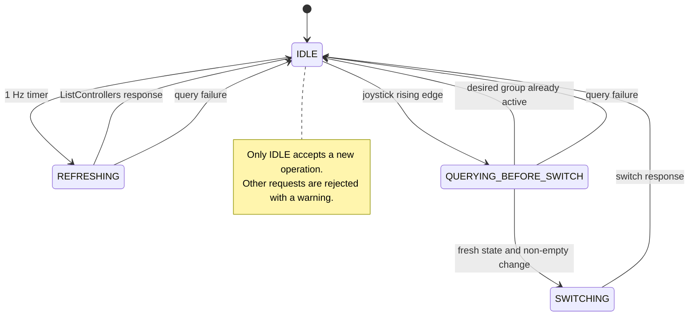
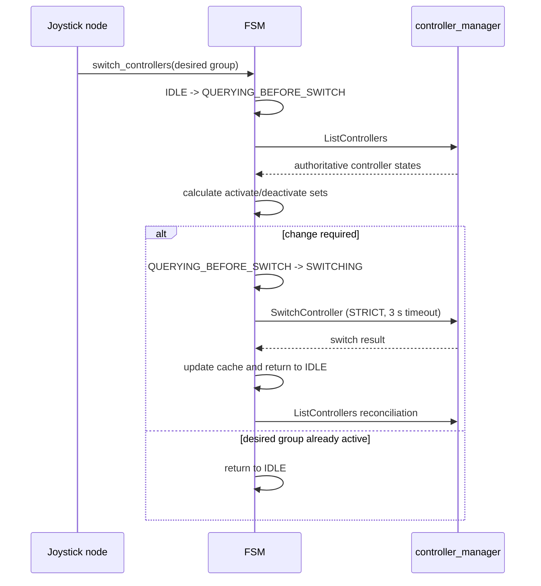

# Controller FSM

This package maps joystick button presses to `ros2_control` controller groups and switches those groups through the controller manager services.

The FSM serializes controller-manager operations so that a periodic state refresh cannot overlap a controller switch. Every switch begins with a fresh `ListControllers` query; the cached state is updated immediately after a successful switch and then reconciled with the controller manager.

## Operation states



## Switch sequence



## Controller-state synchronization

The one-second refresh is for monitoring and recovery. A switch never relies only on that cached state: it performs a new `ListControllers` request first. After a successful switch, the FSM updates its cache immediately and sends another state query to confirm the controller manager result.

Only controllers registered through `key_controller_map` are managed and considered for deactivation. Estimators or other controllers outside those groups are left untouched.

## Joystick mapping

The node declares parameters `key_controller_map.0` through `key_controller_map.10`. Each value is a list describing the desired controller group for that button. A transition is triggered only on a button rising edge.

Example:

```yaml
joy_fsm_node:
  ros__parameters:
    key_controller_map.0:
      - controller_0
    key_controller_map.1:
      - controller_1
    key_controller_map.2:
      - controller_2
    key_controller_map.3:
      - controller_3_1
      - controller_3_2
```

## Behavior during concurrent requests

If a joystick transition arrives while the FSM is refreshing, querying, or switching, it is ignored and a warning is logged. This keeps controller-manager service operations serialized. Release and press the button again after the current operation completes.
